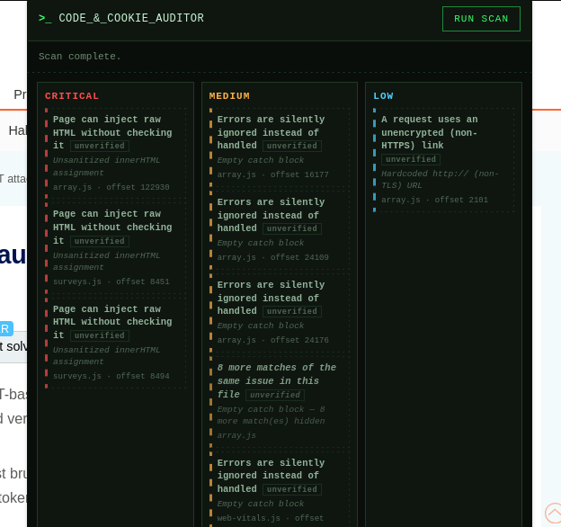
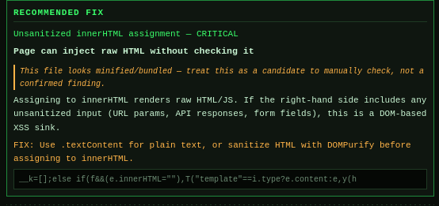
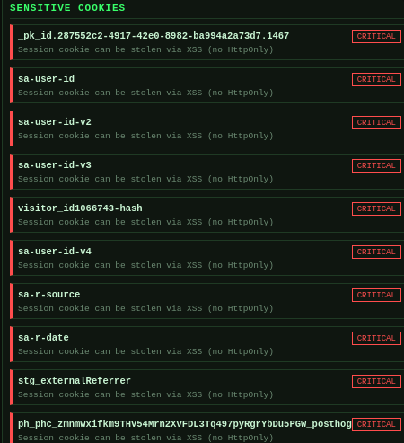

# Code & Cookie Auditor

A browser extension that scans a page's JavaScript for common risky patterns and audits its cookies for insecure or sensitive storage — all client-side, on demand.

<p align="center">
  
</p>

> ⚠️ **Disclaimer — please read before relying on this tool**
>
> This extension is a **source-reading aid, not a vulnerability scanner.** It does not confirm that anything is actually exploitable, and it does not claim to find real vulnerabilities or weaknesses.
>
> What it actually does: it reads through a page's JavaScript so you don't have to scroll the whole file yourself, and it **points out where input/data-handling logic lives** — places where raw data flows into things like `innerHTML`, `eval()`, `document.write()`, cookie assignments, and similar sinks. Think of it as a highlighter for "here's an injection point / input-handling area worth a manual look," not a verdict on whether that spot is actually dangerous.
>
> Every finding needs to be manually reviewed in context. A flagged line can be completely safe (e.g. `innerHTML` fed a hardcoded string, or a sink guarded elsewhere in the code) or genuinely exploitable — the extension can't tell the difference, and it says so directly on flagged matches in minified/bundled code ("treat this as a candidate to manually check, not a confirmed finding"). Use it to narrow down where to look in a large codebase, not as proof that a flaw exists.

## What it does

**Code scan (`analyzer.js` + `content.js`)**
Runs a pattern-based rule engine over every inline `<script>` block on the page, plus best-effort fetches of same-origin/CORS-permitting external scripts (capped at 15, with a fetch timeout). Each finding includes a severity, a plain-language description of the pattern, a suggested fix to consider, and the matching snippet — surfaced as a lead for manual review, not a confirmed bug.

- Critical: `eval()` usage, `new Function()` construction, unsanitized `innerHTML` assignment, `document.write()`, possible hardcoded credentials/API keys
- Known third-party vendor scripts (analytics, CDNs, payment processors, etc.) are recognized and excluded from "this site's own code" findings, since that code isn't something the site owns or can fix

<p align="center">
  
</p>

**Cookie audit (`background.js`)**
Pulls all cookies for the active tab's domain via `chrome.cookies`, then flags ones that look worth a closer look:
- Names matching session/auth/token patterns (`sessionid`, `auth_token`, `jwt`, `api_key`, etc.)
- Missing `HttpOnly` / `Secure` / `SameSite` attributes on cookies that look session-related
- Recognizes well-documented vendor cookies (Segment, Google Identity Services, etc.) so high-entropy vendor IDs aren't misreported as "looks like a stolen session token"

<p align="center">
  
</p>

Results from both scans are combined and shown in the popup.

## Permissions

| Permission | Why |
|---|---|
| `cookies` | Read cookies for the active tab's domain to run the cookie audit |
| `activeTab` | Scan the page currently open |
| `scripting` | Inject the analysis where needed |
| `storage` | Persist settings/results |
| `host_permissions: <all_urls>` | Needed to read cookies and scripts across arbitrary sites you choose to audit |

## Installation (Firefox, unpacked)

1. Open `about:debugging#/runtime/this-firefox`
2. Click **Load Temporary Add-on**
3. Select `manifest.json` from this folder

(Chromium browsers: `chrome://extensions` → enable Developer Mode → **Load unpacked** → select this folder.)

## Usage

1. Navigate to the page you want to audit
2. Click the toolbar icon → **Run Scan**
3. Review findings — each has a severity badge, an explanation of the pattern, and a matched snippet to go manually verify
4. Cookie findings are listed separately with the same severity/explanation format

## Limitations

- Pattern-based, not a full JS parser/AST analysis or taint-tracker — it locates *candidate* input/injection-handling spots, it doesn't trace whether untrusted data actually reaches them
- Will produce false positives on legitimate/safe uses of flagged APIs, and can miss issues in heavily obfuscated or transformed code
- External script fetching only works when the script is same-origin or serves permissive CORS headers
- Intended for auditing sites you own or have permission to test — not for scanning third-party sites without authorization

## Project structure

```
manifest.json        - MV3 manifest, permissions, content script registration
background.js        - service worker: cookie audit + relay to content script
content.js            - runs in page context, collects inline/external scripts
analyzer.js           - the rule engine (regex-based pattern detection)
popup.html/.js/.css  - UI
screenshots/          - README images
icons/
```
