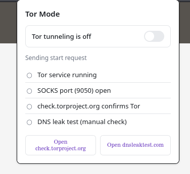
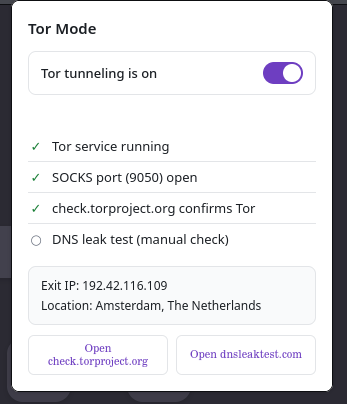
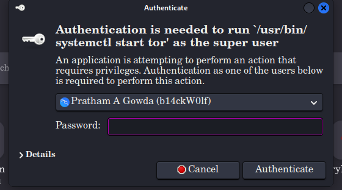
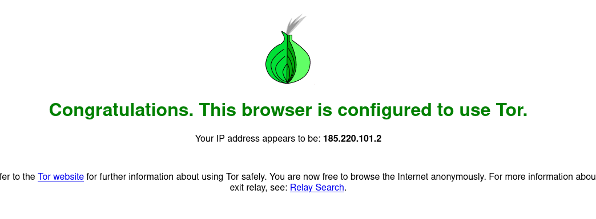
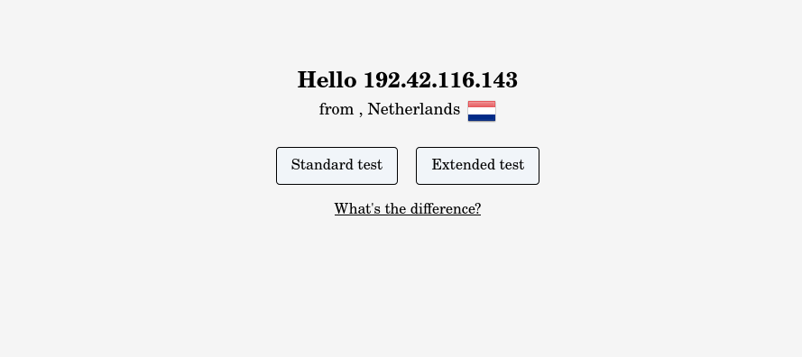
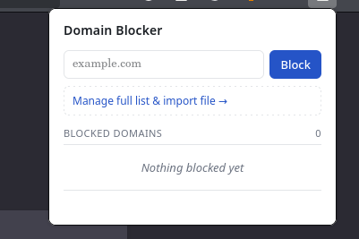
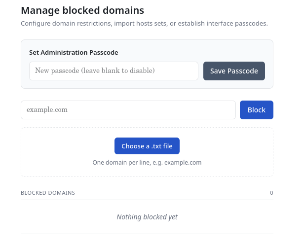
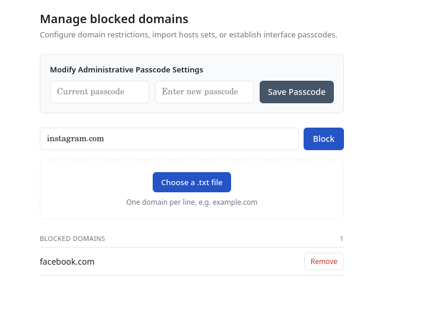
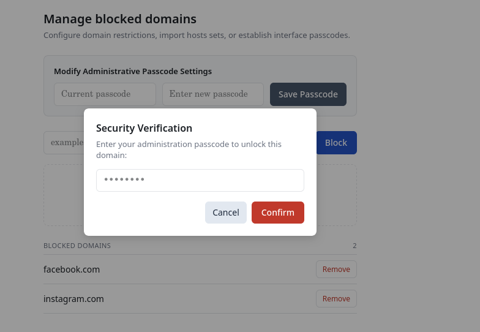
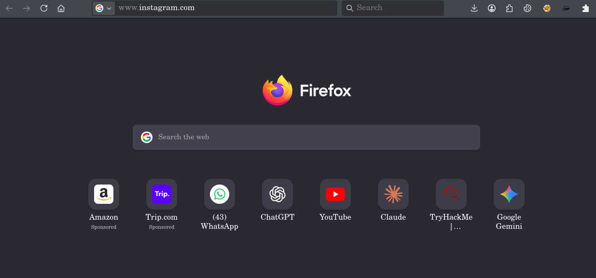

# Code & Cookie Auditor

A browser extension that scans a page's JavaScript for common risky patterns and audits its cookies for insecure or sensitive storage — all client-side, on demand.

<p align="center">
  
</p>

> ⚠️ **Disclaimer — please read before relying on this tool**
>
> This extension is a **source-reading aid, not a vulnerability scanner.** It does not confirm that anything is actually exploitable, and it does not claim to find real vulnerabilities or weaknesses.
>
> What it actually does: it reads through a page's JavaScript so you don't have to scroll the whole file yourself, and it **points out where input/data-handling logic lives** — places where raw data flows into things like `innerHTML`, `eval()`, `document.write()`, cookie assignments, and similar sinks. Think of it as a highlighter for "here's an injection point / input-handling area worth a manual look," not a verdict on whether that spot is actually dangerous.
>
> Every finding needs to be manually reviewed in context. A flagged line can be completely safe (e.g. `innerHTML` fed a hardcoded string, or a sink guarded elsewhere in the code) or genuinely exploitable — the extension can't tell the difference, and it says so directly on flagged matches in minified/bundled code ("treat this as a candidate to manually check, not a confirmed finding"). Use it to narrow down where to look in a large codebase, not as proof that a flaw exists.

## What it does

**Code scan (`analyzer.js` + `content.js`)**
Runs a pattern-based rule engine over every inline `<script>` block on the page, plus best-effort fetches of same-origin/CORS-permitting external scripts (capped at 15, with a fetch timeout). Each finding includes a severity, a plain-language description of the pattern, a suggested fix to consider, and the matching snippet — surfaced as a lead for manual review, not a confirmed bug.

- Critical: `eval()` usage, `new Function()` construction, unsanitized `innerHTML` assignment, `document.write()`, possible hardcoded credentials/API keys
- Known third-party vendor scripts (analytics, CDNs, payment processors, etc.) are recognized and excluded from "this site's own code" findings, since that code isn't something the site owns or can fix

<p align="center">
  
</p>

**Cookie audit (`background.js`)**
Pulls all cookies for the active tab's domain via `chrome.cookies`, then flags ones that look worth a closer look:
- Names matching session/auth/token patterns (`sessionid`, `auth_token`, `jwt`, `api_key`, etc.)
- Missing `HttpOnly` / `Secure` / `SameSite` attributes on cookies that look session-related
- Recognizes well-documented vendor cookies (Segment, Google Identity Services, etc.) so high-entropy vendor IDs aren't misreported as "looks like a stolen session token"

<p align="center">
  
</p>

Results from both scans are combined and shown in the popup.

## Permissions

| Permission | Why |
|---|---|
| `cookies` | Read cookies for the active tab's domain to run the cookie audit |
| `activeTab` | Scan the page currently open |
| `scripting` | Inject the analysis where needed |
| `storage` | Persist settings/results |
| `host_permissions: <all_urls>` | Needed to read cookies and scripts across arbitrary sites you choose to audit |

## Installation (Firefox, unpacked)

1. Open `about:debugging#/runtime/this-firefox`
2. Click **Load Temporary Add-on**
3. Select `manifest.json` from this folder

(Chromium browsers: `chrome://extensions` → enable Developer Mode → **Load unpacked** → select this folder.)

## Usage

1. Navigate to the page you want to audit
2. Click the toolbar icon → **Run Scan**
3. Review findings — each has a severity badge, an explanation of the pattern, and a matched snippet to go manually verify
4. Cookie findings are listed separately with the same severity/explanation format

## Limitations

- Pattern-based, not a full JS parser/AST analysis or taint-tracker — it locates *candidate* input/injection-handling spots, it doesn't trace whether untrusted data actually reaches them
- Will produce false positives on legitimate/safe uses of flagged APIs, and can miss issues in heavily obfuscated or transformed code
- External script fetching only works when the script is same-origin or serves permissive CORS headers
- Intended for auditing sites you own or have permission to test — not for scanning third-party sites without authorization

## Project structure

```
manifest.json        - MV3 manifest, permissions, content script registration
background.js        - service worker: cookie audit + relay to content script
content.js            - runs in page context, collects inline/external scripts
analyzer.js           - the rule engine (regex-based pattern detection)
popup.html/.js/.css  - UI
screenshots/          - README images
icons/
```


<h1 align="center">🧅 Tor Mode</h1>

<p align="center">
A Firefox extension that switches your browser onto an already-installed Tor service with one toolbar toggle — starting the service, routing traffic through it, and verifying the connection.
</p>

<p align="center">
  
  &nbsp;&nbsp;&nbsp;
  
</p>

> ⚠️ **Disclaimer**
>
> **Tor Mode does not install Tor.** It is a *switch*, not an *installer* — it assumes the `tor` service is already installed on your system and manageable via `systemctl`. All this extension does is start/stop that pre-existing service and point Firefox's proxy at it. If `tor` isn't installed on your machine, install it first through your OS's package manager (e.g. `sudo apt install tor`) — Tor Mode will have nothing to switch on otherwise.
>
> It also controls your system's Tor service and browser proxy settings directly via `sudo`/`pkexec`. Review `tor_mode_host.py` before installing if you want to confirm exactly what it runs on your behalf.

---

## What it does

Click the toggle and Tor Mode will:

1. Start the local `tor` systemd service (if it isn't already running)
2. Wait for the SOCKS5 port (`127.0.0.1:9050`) to come up
3. Verify you're actually exiting through Tor via `check.torproject.org`
4. Switch Firefox's proxy settings to route through that SOCKS port, with DNS resolution also going through Tor to avoid DNS leaks
5. Show you the exit IP and its approximate location

Switching it off stops the Tor service and restores your normal proxy settings.

Because starting/stopping a system service and shelling out to `curl` aren't things a sandboxed browser extension can do on its own, the heavy lifting is handled by a small native messaging host (`tor_mode_host.py`) that the extension talks to over stdin/stdout — which is also why the OS may prompt you to authenticate:

<p align="center">
  
</p>

## Architecture

```
popup.js  →  background.js  →  native messaging  →  tor_mode_host.py  →  systemctl / curl
   (UI)      (proxy control)                          (privileged work)
```

- **`popup.js` / `popup.html`** — the toolbar UI. Purely reflects extension storage state; does no work itself.
- **`background.js`** — owns the connection to the native host and flips `browser.proxy.settings` (or `chrome.proxy.settings` on Chromium) once the host confirms Tor is up.
- **`tor_mode_host.py`** — native messaging host. Starts/stops the **pre-installed** `tor` service via `sudo -n` (falling back to `pkexec`), polls the SOCKS port, and verifies the exit node.
- **`install.sh`** — registers the native host with Firefox so the extension is allowed to launch it.

## Requirements

- Firefox 109+
- **`tor` already installed** and available as a systemd service (`systemctl start/stop tor`) — Tor Mode does not install this for you
- `curl` (used for the exit-node and geolocation checks)
- Either passwordless `sudo` configured for `systemctl start tor` / `systemctl stop tor`, or `pkexec`/polkit available for a graphical privilege prompt

## Installation

1. Load the extension in Firefox via `about:debugging` → **This Firefox** → **Load Temporary Add-on** → select `manifest.json` (or install the packaged `.xpi`).
2. Register the native messaging host — this step is required separately from loading the extension, since the host script lives outside the browser sandbox:
   ```bash
   ./install.sh
   ```
   This writes `~/.mozilla/native-messaging-hosts/com.b14ckwolf.tormode.json`, pointing at `tor_mode_host.py`'s location at the time you ran the script. If you move the script afterward, edit the `path` field in that JSON file to match, and use a path without spaces to avoid native-messaging quirks.
3. Reload the extension and click the toolbar icon to toggle Tor on.

## Permissions

- `nativeMessaging` — to talk to `tor_mode_host.py`
- `proxy` — to set Firefox's SOCKS proxy
- `storage` — to persist and broadcast connection status to the popup

If proxy switching fails with a "private browsing permission" error, go to `about:addons` → Tor Mode → set **Run in Private Windows** to **Allow**.

## Verifying it's working

The popup shows four live status checks — Tor service, SOCKS port, exit-node verification, DNS — plus the detected exit IP and location once connected. You can also manually verify via the buttons in the popup:

<p align="center">
  
</p>

<p align="center">
  
</p>

- [check.torproject.org](https://check.torproject.org/) — confirms your traffic is exiting through Tor
- [dnsleaktest.com](https://dnsleaktest.com/) — confirms DNS requests aren't leaking outside the tunnel

## Troubleshooting

| Symptom | Likely cause |
|---|---|
| "Couldn't reach the native host" | `install.sh` wasn't run, or the `path` in `com.b14ckwolf.tormode.json` doesn't point to where `tor_mode_host.py` actually lives |
| "Could not start the Tor service" | `tor` isn't installed, or there's no passwordless sudo for `systemctl start/stop tor` and `pkexec`/polkit isn't available (common on headless or SSH-only setups) |
| "Tor service is active but the SOCKS port never opened" | Check `SocksPort` in `/etc/tor/torrc` — it should be `9050` |
| Toggle succeeds but Firefox's proxy settings never change | Check "Run in Private Windows" permission, and confirm `network.proxy.type` isn't locked by another extension or policy in `about:config` |

## Project structure

```
manifest.json        - extension manifest, permissions
background.js        - native messaging + proxy control logic
popup.html/.js        - UI, status display
tor_mode_host.py      - native messaging host (Tor service control, verification)
install.sh            - registers the native messaging host with Firefox
screenshots/          - README images
icons/
```


<h1 align="center">🚫 Domain Blocker</h1>

<p align="center">
A lightweight browser extension that blocks websites by domain, entirely in-browser, using Manifest V3's <code>declarativeNetRequest</code> API — no root access, no hosts-file editing, no background process required.
</p>

<p align="center">
  
</p>

## What it does

- Add a domain from the toolbar popup, or from the full **Manage** page
- Blocking is enforced natively by the browser's network layer — before any DNS lookup happens — so it applies instantly across every resource type (pages, scripts, images, XHR, fonts, etc.), and covers all subdomains automatically
- Rules persist across browser restarts
- Optional **administration passcode** — once set, adding *or* removing a domain requires the passcode, so you can't casually undo a block on impulse
- Bulk import a `.txt` file (one domain per line) to block a whole list at once

<p align="center">
  
</p>

## Usage

**Quick block** — click the toolbar icon, type a domain, hit **Block**.

**Full management** — click **Manage full list & import file** in the popup (or open `manage.html` directly) to:
- Set/change/remove the administration passcode
- Import a `.txt` list of domains in bulk
- View and remove currently blocked domains

<p align="center">
  
</p>

Once a passcode is set, removing a domain asks you to confirm it:

<p align="center">
  
</p>

A blocked domain simply won't load — the browser refuses the request before it goes anywhere:

<p align="center">
  
</p>

Removing it from the list restores normal access immediately:

<p align="center">
  
</p>

## Permissions

| Permission | Why |
|---|---|
| `declarativeNetRequest` | Enforce domain blocking natively |
| `storage` | Persist the blocklist and passcode |
| `host_permissions: <all_urls>` | Needed so blocking rules can apply to any domain you add |

## Installation (Firefox, unpacked)

1. Open `about:debugging#/runtime/this-firefox`
2. Click **Load Temporary Add-on**
3. Select `manifest.json` from this folder

(Chromium browsers: `chrome://extensions` → enable Developer Mode → **Load unpacked** → select this folder.)

---

## ⚠️ Limitations

**This only blocks that domain inside the one browser it's installed in.**

- It has no effect on other browsers on the same machine. If Domain Blocker is only installed in Firefox, the same site is still fully reachable from Chrome, Edge, etc. on that same laptop.
- It even has no effect on a *different browser that also has Domain Blocker installed*, if the block wasn't separately configured there too — each browser keeps its own extension storage and its own set of `declarativeNetRequest` rules. A blocklist set in one browser's copy of the extension does not carry over to another browser's copy.
- Anyone with access to the machine can simply open an unrestricted browser (or a fresh profile) and reach the site — this tool is a per-browser convenience blocker, not a system-wide restriction.

### If you actually need a system-wide, browser-independent block

Use the OS-level hosts file instead — this blocks the domain for **every browser and every application** on the machine, regardless of extensions:

```bash
sudo nano /etc/hosts
```

Add a line like:

```
127.0.0.1 example.com
```

This redirects all requests for that domain on this machine to localhost, so nothing can reach it — no extension, browser setting, or "just open a different browser" workaround gets around it. (You'll want a line per domain, and per `www.` subdomain if the site uses one, e.g. both `example.com` and `www.example.com`.)

## Project structure

```
manifest.json   - MV3 manifest, permissions
background.js   - rebuilds declarativeNetRequest rules from storage
popup.html/.js  - quick add/view UI
manage.html/.js - full blocklist management UI (passcode, bulk import)
screenshots/    - README images
icons/
```
